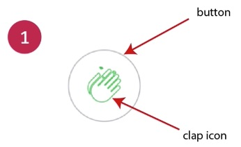
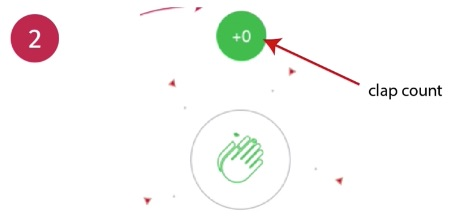
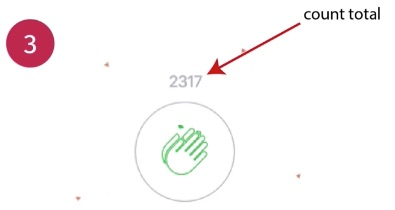

# The Complete Guide to Advanced React Component Patterns

## Table of Contents

- [The Complete Guide to Advanced React Component Patterns](#the-complete-guide-to-advanced-react-component-patterns)
  - [Table of Contents](#table-of-contents)
  - [**Section 1: Introduction**](#section-1-introduction)
  - [**Section 2: The Medium Clap: Real-world Component for Studying Advanced React Patterns**](#section-2-the-medium-clap-real-world-component-for-studying-advanced-react-patterns)
    - [Why build the medium clap?](#why-build-the-medium-clap)
    - [Building and styling the medium clap](#building-and-styling-the-medium-clap)
    - [Handling user interactivity](#handling-user-interactivity)
    - [Higher order components recap](#higher-order-components-recap)
    - [Beginning to animate the clap](#beginning-to-animate-the-clap)
    - [Creating and updating the animation timeline](#creating-and-updating-the-animation-timeline)
    - [Resolving wrong animated scale](#resolving-wrong-animated-scale)
    - [Animating the total count](#animating-the-total-count)
  - [**Section 3: Custom Hooks: The first Foundational Pattern**](#section-3-custom-hooks-the-first-foundational-pattern)
  - [**Section 4: The Compound Components Pattern**](#section-4-the-compound-components-pattern)
  - [**Section 5: Patterns for Crafting Reusable Styles**](#section-5-patterns-for-crafting-reusable-styles)
  - [**Section 6: The Control Props Pattern**](#section-6-the-control-props-pattern)
  - [**Section 7: Custom Hooks: A Deeper Look at the Foundational Pattern**](#section-7-custom-hooks-a-deeper-look-at-the-foundational-pattern)
  - [**Section 8: The Props Collection Pattern**](#section-8-the-props-collection-pattern)
  - [**Section 9: The Props Getters Pattern**](#section-9-the-props-getters-pattern)
  - [**Section 10: The State Initialiser Pattern**](#section-10-the-state-initialiser-pattern)
  - [**Section 11: The State Reducer Pattern**](#section-11-the-state-reducer-pattern)
  - [**Section 12: (Bonus) Classifying the Patterns: How to choose the best API**](#section-12-bonus-classifying-the-patterns-how-to-choose-the-best-api)

## **Section 1: Introduction**

Design Patterns

- Time-tested solution to recurring design problems

Why Advanced React Patterns

- Solve issues related to building **reusable components** using proven solutions
- Development of highly cohesive components with **minimal coupling**
- Better ways to **share logic** between components

**[⬆ back to top](#table-of-contents)**

## **Section 2: The Medium Clap: Real-world Component for Studying Advanced React Patterns**

### Why build the medium clap?

- [How the demo showcase works](https://advanced-react-patterns-ultrasimplified.netlify.app/)

Building and styling the medium clap
1. The default State of the Component - unclicked
2. The Clap Count & Burst Shown
3. The Clap Total count Show





```javascript
<button>
  <ClapIcon />
  <ClapCount />
  <CountTotal />
</button>
```

**[⬆ back to top](#table-of-contents)**

### Building and styling the medium clap

- [Free Icons for Everything - Noun Project](https://thenounproject.com/)
- [SVGOMG - SVGO's Missing GUI](https://jakearchibald.github.io/svgomg/)
- [World's Best SVG Compressor](https://vecta.io/nano)

```javascript
const MediumClap = () => (
  <button>
    <ClapIcon />
    <ClapCount />
    <CountTotal />
  </button>
)

const ClapIcon = ({ isClicked }) => (
  <span>
    <svg> ... </svg>
  </span>
)
const ClapCount = ({ count }) => <span>+ {count}</span>
const CountTotal = ({ countTotal }) => <span>{countTotal}</span>
```

**[⬆ back to top](#table-of-contents)**

### Handling user interactivity

```javascript
const initialState = {
  count: 0,
  countTotal: 267,
  isClicked: false
}

const MediumClap = () => {
  const MAXIMUM_USER_CLAP = 50
  const [clapState, setClapState] = useState(initialState)
  const { count, countTotal, isClicked } = clapState

  const handleClapClick = () => {
    animate()
    setClapState(prevState => ({ ... }))
  }
  return (
    <button onClick={handleClapClick} >
      <ClapIcon isClicked={isClicked}/>
      <ClapCount count={count} />
      <CountTotal countTotal={countTotal} />
    </button>
  )
}

const ClapIcon = ({ isClicked }) => (
  <span>
    <svg className={`${isClicked && styles.checked}`>
    </svg>
  </span>
)
const ClapCount = ({ count }) => <span>+ {count}</span>
const CountTotal = ({ countTotal }) => <span>{countTotal}</span>
```

**[⬆ back to top](#table-of-contents)**

### Higher order components recap

[console.log timestamps in Chrome](https://stackoverflow.com/questions/12008120/console-log-timestamps-in-chrome)
- Console: (...) -> Settings -> Preferences -> Console -> [x] Show timestamps

[Higher-Order Components](https://reactjs.org/docs/higher-order-components.html)
- Component -> HOC -> Component*
- Component(Logic) -> HOC -> Component*(Animation +Logic)

```javascript
const withClapAnimation = WrappedComponent => {
  class WithClapAnimation extends Component {
    animate = () => {
      console.log('%c Animate', 'background:yellow; color:black')
    }
    render() {
      return <WrappedComponent {...this.props} animate={this.animate}/>
    }
  }
  return WithClapAnimation
}

const MediumClap = ({ animate }) => {
  const handleClapClick = () => {
    animate()
    setClapState(prevState => ({ ... }))
  }

  return (
    <button 
      className={styles.clap} 
      onClick={handleClapClick}
    >
      <ClapIcon isClicked={isClicked} />
      <ClapCount count={count} />
      <CountTotal countTotal={countTotal} />
    </button>
  )
}

export default withClapAnimation(MediumClap)
```

**[⬆ back to top](#table-of-contents)**

### Beginning to animate the clap

- [JavaScript Motion Graphics Library](https://mojs.github.io/)

Animation Timeline
| Animation           | Element         | Property | Delay              | Start value (time) | Stop value (time)      |
|:-------------------:|:---------------:|:--------:|:------------------:|:------------------:|:----------------------:|
| scaleButton         | #clap           | scale    | 0                  | 1.3 (t=delay)      | 1 (t=duration)         |
| triangleBurst       | #clap           | radius   | 0                  | 50 (t=delay)       | 95 (t=duration)        |
| circleBurst         | #clap           | radius   | 0                  | 50 (t=delay)       | 75 (t=duration)        |
| countAnimation      | #clapCount      | opacity  | 0                  | 0 (t=delay)        | 1 (t=duration)         |
| countAnimation      | #clapCount      | opacity  | duration / 2       | 1 (t=duration)     | 0 (t=duration + delay) |
| countTotalAnimation | #clapCountTotal | opacity  | (3 * duration) / 2 | 0 (t=delay)        | 1 (t=duration)         |

```javascript
import mojs from 'mo-js'

const withClapAnimation = WrappedComponent => {
  class WithClapAnimation extends Component {
    state = {
      animationTimeline: new mojs.Timeline()
    }
    render() {
      return <WrappedComponent 
        {...this.props} 
        animationTimeline={this.state.animationTimeline />
    }
  }
  return WithClapAnimation
}

const MediumClap = ({ animationTimeline }) => {
  const handleClapClick = () => {
    animationTimeline.replay()
    setClapState(prevState => ({ ... }))
  }

  return (
    <button 
      className={styles.clap} 
      onClick={handleClapClick}
    >
      <ClapIcon isClicked={isClicked} />
      <ClapCount count={count} />
      <CountTotal countTotal={countTotal} />
    </button>
  )
}

export default withClapAnimation(MediumClap)
```

**[⬆ back to top](#table-of-contents)**

### Creating and updating the animation timeline

- [CSS Animation Timing Function](https://www.w3schools.com/cssref/css3_pr_animation-timing-function.asp)
- [mo.js Base Easing Functions](https://mojs.github.io/api/easing/base-functions.html)
 
Animation Timeline
| Animation           | Element         | Property | Delay              | Start value (time) | Stop value (time)      |
|:-------------------:|:---------------:|:--------:|:------------------:|:------------------:|:----------------------:|
| scaleButton         | #clap           | scale    | 0                  | 1.3 (t=delay)      | 1 (t=duration)         |

```javascript
import mojs from 'mo-js'

const withClapAnimation = WrappedComponent => {
  class WithClapAnimation extends Component {
    animationTimeline = new mojs.Timeline()
    state = {
      animationTimeline: this.animationTimeline
    }

    componentDidMount() {
      const scaleButton = new mojs.Html({
        el: "#clap",
        duration: 300,
        scale: { 1.3 : 1 },
        easing: mojs.easing.ease.out
      })
      const newAnimationTimeline = 
        this.animationTimeline.add([scaleButton])
      this.setState({ animationTimeline: newAnimationTimeline})
    }

    render() {
      return <WrappedComponent 
        {...this.props} 
        animationTimeline={this.state.animationTimeline />
    }
  }
  return WithClapAnimation
}

const MediumClap = ({ animationTimeline }) => {
  const handleClapClick = () => {
    animationTimeline.replay()
    setClapState(prevState => ({ ... }))
  }

  return (
    <button 
      id="clap"
      className={styles.clap} 
      onClick={handleClapClick}
    >
      <ClapIcon isClicked={isClicked} />
      <ClapCount count={count} />
      <CountTotal countTotal={countTotal} />
    </button>
  )
}

export default withClapAnimation(MediumClap)
```

**[⬆ back to top](#table-of-contents)**

### Resolving wrong animated scale

```javascript
import mojs from 'mo-js'

const withClapAnimation = WrappedComponent => {
  class WithClapAnimation extends Component {
    animationTimeline = new mojs.Timeline()
    state = {
      animationTimeline: this.animationTimeline
    }

    componentDidMount() {
      const tlDuration = 300
      const scaleButton = new mojs.Html({
        el: "#clap",
        duration: tlDuration,
        scale: { 1.3 : 1 },
        easing: mojs.easing.ease.out
      })

      // scale back to 1 before animation start
      const clap = document.getElementById('clap')
      clap.style.transform = 'scale(1,1)'

      const newAnimationTimeline = 
        this.animationTimeline.add([scaleButton, countTotalAnimation])
      this.setState({ animationTimeline: newAnimationTimeline})
    }

    render() {
      return <WrappedComponent 
        {...this.props} 
        animationTimeline={this.state.animationTimeline />
    }
  }
  return WithClapAnimation
}

export default withClapAnimation(MediumClap)
```

**[⬆ back to top](#table-of-contents)**

### Animating the total count

```javascript
import mojs from 'mo-js'

const withClapAnimation = WrappedComponent => {
  class WithClapAnimation extends Component {
    animationTimeline = new mojs.Timeline()
    state = {
      animationTimeline: this.animationTimeline
    }

    componentDidMount() {
      const tlDuration = 300
      ... 
      const countTotalAnimation = new mojs.Html({
        el: "#clapCountTotal",
        delay: (3 * tlDuration) / 2,
        duration: tlDuration,
        // opacity from [t=delay, 0] to [t=300, 1]
        opacity: { 0 : 1 },
        // move up y axis from [t=delay, y=0] to [t=300, y=-3]
        y: { 0 : -3 }
      })

      const newAnimationTimeline = 
        this.animationTimeline.add([scaleButton, countTotalAnimation])
      this.setState({ animationTimeline: newAnimationTimeline})
    }

    render() {
      return <WrappedComponent 
        {...this.props} 
        animationTimeline={this.state.animationTimeline />
    }
  }
  return WithClapAnimation
}

const CountTotal = ({ countTotal }) => (
  <span id="clapCountTotal" className={styles.total}>
    {countTotal}
  </span>
)

export default withClapAnimation(MediumClap)
```

**[⬆ back to top](#table-of-contents)**

## **Section 3: Custom Hooks: The first Foundational Pattern**

**[⬆ back to top](#table-of-contents)**

## **Section 4: The Compound Components Pattern**

**[⬆ back to top](#table-of-contents)**

## **Section 5: Patterns for Crafting Reusable Styles**

**[⬆ back to top](#table-of-contents)**

## **Section 6: The Control Props Pattern**

**[⬆ back to top](#table-of-contents)**

## **Section 7: Custom Hooks: A Deeper Look at the Foundational Pattern**

**[⬆ back to top](#table-of-contents)**

## **Section 8: The Props Collection Pattern**

**[⬆ back to top](#table-of-contents)**

## **Section 9: The Props Getters Pattern**

**[⬆ back to top](#table-of-contents)**

## **Section 10: The State Initialiser Pattern**

**[⬆ back to top](#table-of-contents)**

## **Section 11: The State Reducer Pattern**

**[⬆ back to top](#table-of-contents)**

## **Section 12: (Bonus) Classifying the Patterns: How to choose the best API**

**[⬆ back to top](#table-of-contents)**
```
